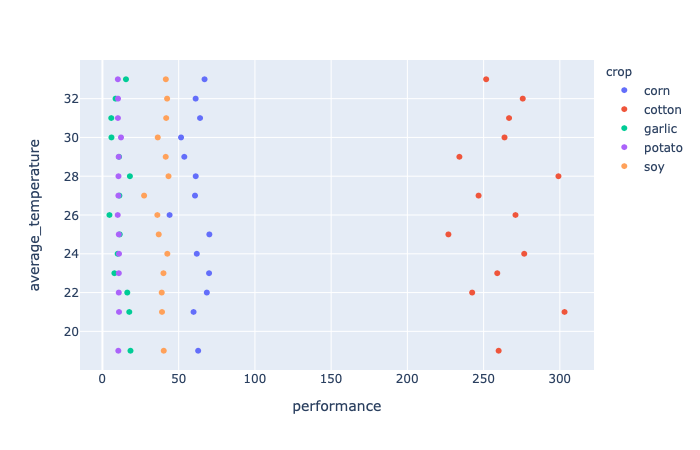

# Crops

This repository is a data science project handed in as the final project in for the [5-week data science course by ML Graz](https://www.mlgraz.at/course.html).

## Data Source

For this project the [Agricultura dataset](https://www.kaggle.com/calvom/agricultura) was used.

### Description

The following information is provided by the dataset:
* province
* department
* crop (32 different crops)
* year (a growing year always starts in the autumn of the year before)
* average_temperature [degrees Celsius]
* area_sowed [hectars]
* area_harvested [hectars]
* production [tons]
* performance [kg / ha]
* quality (high/middle/low)

## Notebooks
The ipython notebooks used for this project can be found in `notebooks/`.

## Results

Detailed results are presented in the presentation `reports/Agriculture.pdf`.

### 1. How did agriculture change over the last decades?

### 2. Did average temperatures change over the last decades?

### 3. Does higher performance effect the quality of the crops?

### 4. At which average temperatures do crops flourish and produce high yields?

### 5. Which crop has the best performance?

## Machine Learning

The used models all provided very similar results. The quality could only be predicted about 2 in 5 times using the provided dataset.

| Algorithm | Score |
|:------------|:------:|
| Random Forest Classifier | 0.3999 |
| Logistic Regression | 0.3955 |
| Support Vector Machines | 0.4012 |
| Neural network | 0.4014 |
